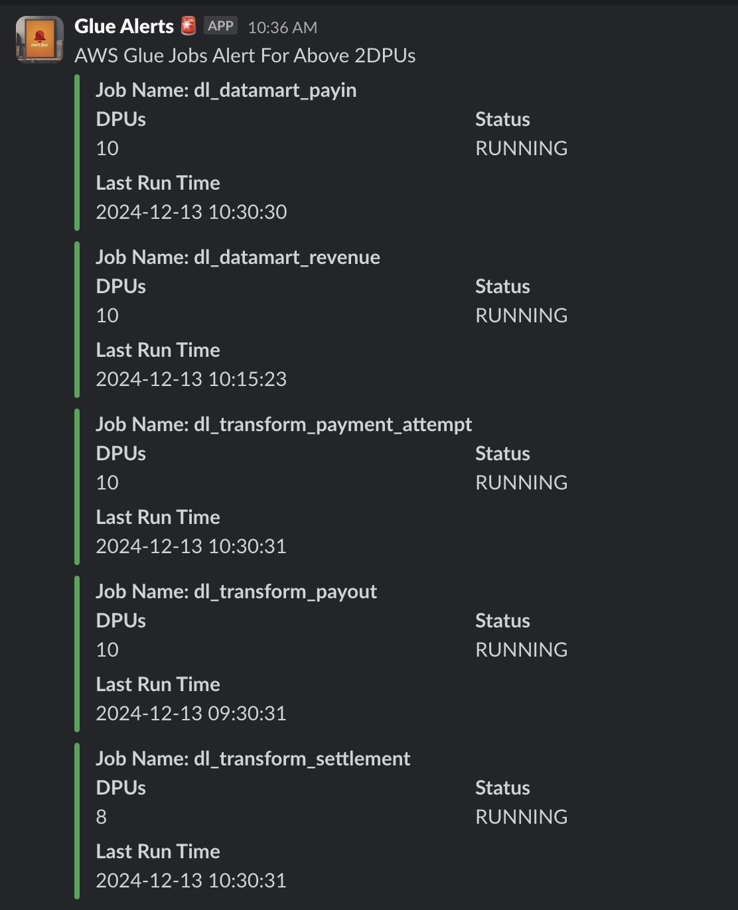

# AWS Glue Job Monitoring and Slack Notifications

This Python script monitors AWS Glue jobs, identifies jobs consuming more than 2 DPUs, and sends detailed notifications to a Slack channel using a webhook integration. It categorizes jobs into running, idle, and failed states for better visibility.

---

## Prerequisites

1. **AWS CLI Installed and Configured**:
   - Install the AWS CLI if not already installed.
   - Configure your AWS credentials or SSO profile:
     ```bash
     aws configure
     ```
   - If using SSO:
     ```bash
     aws configure sso
     ```

2. **Slack Webhook URL**:
   - Set up an incoming webhook in your Slack workspace.
   - Save the webhook URL; it will be used in the script.

3. **Python Dependencies**:
   - Ensure the following Python libraries are installed:
     - `boto3`
     - `urllib3`

   Install them via pip if needed:
   ```bash
   pip install boto3 urllib3
   ```

---

## Configuration

1. **Slack Webhook URL**:
   - Replace the placeholder `<SLACK_WEBHOOK_URL>` in the script with your actual Slack webhook URL.
     ```python
     SLACK_WEBHOOK_URL = '<SLACK_WEBHOOK_URL>'
     ```

2. **AWS Profile Name**:
   - Replace `<AWS_PROFILE_NAME>` with the AWS CLI profile name you are using to access AWS resources.
     ```python
     aws_profile = '<AWS_PROFILE_NAME>'
     ```

---

## Usage

1. **Clone or Download the Repository**:
   - Clone the repository or download the script file.

2. **Run the Script**:
   - Execute the script using Python:
     ```bash
     python script_name.py
     ```

3. **Output**:
   - The script will print categorized job details (`Running`, `Idle`, `Failed`) in the terminal.
   - It will also send a formatted Slack notification with details about jobs consuming more than 2 DPUs.

---

## Features

- **Categorized Job Monitoring**:
  - The script categorizes Glue jobs into:
    - `Running` jobs
    - `Idle` jobs
    - `Failed` jobs

- **Dynamic DPU Threshold**:
  - Monitors jobs consuming more than 2 DPUs and categorizes them by their states.

- **Slack Notifications**:
  - Sends detailed alerts to Slack with job details, including:
    - Job Name
    - DPU Capacity
    - Status
    - Last Run Time

- **Color-Coded Alerts**:
  - Red for failed or high-capacity jobs.
  - Yellow for moderate-capacity jobs.
  - Green for low-capacity jobs.

---

## Sample Output

### Terminal Output:
```
Jobs with more than 2 DPUs:
Running Jobs:
Job Name: example-running-job, DPUs: 4, Status: RUNNING, Last Run Time: 2024-12-13 10:00:00
Idle Jobs:
Job Name: example-idle-job, DPUs: 3, Status: STOPPED, Last Run Time: 2024-12-12 15:30:00
Failed Jobs:
Job Name: example-failed-job, DPUs: 2, Status: FAILED, Last Run Time: 2024-12-11 08:00:00
```

### Slack Output:

---

## Customization

- **DPU Threshold**:
  - Adjust the logic in `get_glue_jobs_exceeding_2dpu` to monitor jobs with a different DPU threshold.

- **Slack Message Formatting**:
  - Modify the `send_slack_alert` function to customize message colors and formatting.

---

## Troubleshooting

1. **SSO Token Expiration**:
   - If using SSO, refresh your session with:
     ```bash
     aws sso login
     ```

2. **Credentials Not Found**:
   - Ensure your AWS credentials or profile are correctly configured in `~/.aws/credentials` or `~/.aws/config`.

3. **Slack Notification Issues**:
   - Verify the Slack webhook URL is correct.
   - Ensure the Slack app has permission to post to the desired channel.

---

## License

This project is licensed under the MIT License. See the LICENSE file for details.

---

## Author

- **Thanneermalai Chidambaram**
- **contact:thanneermalaichidambaram@gmail.com¡**
